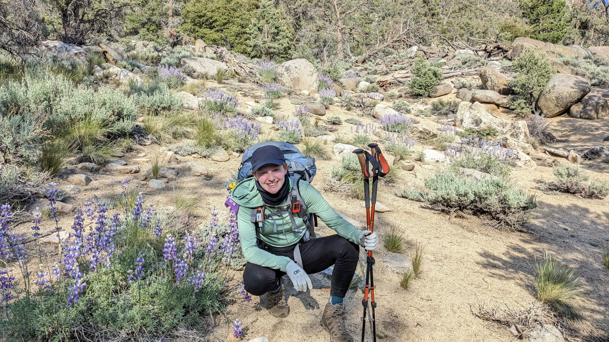

# Johanna Kinsler

## Data Engineer
I am a data engineer with four years experience building custom cloud platforms and data pipelines.

My expertise includes cloud platform tools, programming languages, database languages, scripting, data modeling and data analysis.

## Climate Specialist
I am specifically interested in helping solve data engineering problems related to climate conservation. I recently completed the [Tera.do](https://terra.do/) learning for action program and am currently enrolled in the [Earth Lab](https://www.earthdatascience.org/) program at University of Colorado Boulder.

Please get in touch if you have a climate project you'd like to collaborate on.
